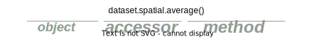

API Reference
=============

Overview
--------

Most public ``xcdat`` APIs operate on ``xarray.Dataset`` objects. ``xcdat`` follows this design pattern because coordinate variable bounds are often required to perform robust calculations.
Currently, coordinate variable bounds can only be stored on ``Dataset`` objects and not ``DataArray`` objects. Refer to this `issue`_ for more information.

.. _issue: https://github.com/pydata/xarray/issues/1475

.. currentmodule:: xcdat

Top-level API Functions
-----------------------

Below is a list of top-level API functions that are available in ``xcdat``.

.. autosummary::
    :toctree: generated/

    open_dataset
    open_mfdataset
    center_times
    decode_time
    swap_lon_axis
    compare_datasets
    get_dim_coords
    get_dim_keys
    create_bounds
    create_axis
    create_gaussian_grid
    create_global_mean_grid
    create_grid
    create_uniform_grid
    create_zonal_grid
    tutorial.open_dataset

Accessors
---------

What are accessors?
~~~~~~~~~~~~~~~~~~~

``xcdat`` provides ``Dataset`` accessors, which are implicit namespaces for custom functionality that clearly identifies it as separate from built-in xarray methods.
``xcdat`` implements accessors to extend xarray with custom functionality because it is the officially recommended and most common practice (over sub-classing).

In the example below, custom spatial functionality is exposed by chaining the ``spatial`` accessor attribute to the ``Dataset`` object.
This chaining enables access to the underlying spatial ``average()`` method.

How do I use ``xcdat`` accessors?
~~~~~~~~~~~~~~~~~~~~~~~~~~~~~~~~~

First, import the package:

.. code-block:: python

    >>> from xcdat

Then open up a dataset file as a ``Dataset`` object:

.. code-block:: python

    >>> ds = xcdat.open_dataset("path/to/file", data_var="ts")

Now chain the accessor attribute to the ``Dataset`` to expose the accessor class attributes, methods, or properties:

.. code-block:: python

    >>> ds = ds.spatial.average("ts", axis=["X", "Y"])

.. note::

   Accessors are created once per Dataset instance. New instances, like those
   created from arithmetic operations will have new accessors created.

Classes
~~~~~~~

.. autosummary::
   :toctree: generated/

    bounds.BoundsAccessor
    spatial.SpatialAccessor
    temporal.TemporalAccessor
    regridder.accessor.RegridderAccessor
    regridder.regrid2.Regrid2Regridder
    regridder.xesmf.XESMFRegridder
    regridder.xgcm.XGCMRegridder

.. currentmodule:: xarray

Attributes
~~~~~~~~~~

.. autosummary::
   :toctree: generated/
   :template: autosummary/accessor_attribute.rst

    Dataset.bounds.map
    Dataset.bounds.keys
    Dataset.regridder.grid

.. _dsattr_1:

Methods
~~~~~~~

.. autosummary::
   :toctree: generated/
   :template: autosummary/accessor_method.rst

    Dataset.bounds.add_bounds
    Dataset.bounds.add_time_bounds
    Dataset.bounds.get_bounds
    Dataset.bounds.add_missing_bounds
    Dataset.spatial.average
    Dataset.temporal.average
    Dataset.temporal.group_average
    Dataset.temporal.climatology
    Dataset.temporal.departures
    Dataset.regridder.horizontal
    Dataset.regridder.vertical

.. _dsmeth_1:

.. currentmodule:: xcdat

.. _cdat-mapping:

CDAT Mapping Table
------------------

The table below maps the supported xCDAT operations to the equivalent CDAT and xCDAT APIs.
It is especially useful for those who are transitioning over from CDAT to xarray/xCDAT.

.. list-table::
   :widths: 20 40 40
   :header-rows: 1

   * - How do I...
     - xCDAT
     - CDAT
   * - Open dataset files?
     - ``xcdat.open_dataset()`` and ``xcdat.open_mfdataset()``
     - ``cdms2.open()``
   * - Get coordinate bounds?
     - ``Dataset.bounds.get_bounds()``
     - ``cdms2.tvariable.getBounds()``
   * - Set coordinate bounds for a single axis?
     - ``Dataset.bounds.add_bounds()``
     - ``cdms2.tvariable.setBounds()``
   * - Set coordinate bounds for all axes with missing bounds?
     - ``Dataset.bounds.add_missing_bounds()``
     - N/A
   * - Center time coordinates using time bounds?
     - ``xcdat.center_times()``
     - N/A
   * - Swap the longitude axis orientation between (-180 to 180) and (0 to 360)?
     - ``axis.swap_lon_axis()``
     - N/A
   * - Spatially average over an optionally specified rectilinear grid?
     - ``Dataset.spatial.average("VAR_KEY", axis=["X", "Y"])`` specifying ``lat_bounds`` and ``lon_bounds``
     - ``cdutil.averager(TransientVariable, axis="xy")``, optionally subset ``TransientVariable`` with ``cdutil.region.domain()``
   * - Decode time coordinates with CF/Non-CF units?
     - ``xr.decode_cf()`` specifying ``decode_times=True``, or ``xcdat.decode_time()``
     - ``cdms2.axis.Axis.asComponentTime()``
   * - Temporally averaging with a single time-averaged snapshot and time coordinates removed?
     - ``Dataset.temporal.average("VAR_KEY")``
     - ``cdutil.averager(TransientVariable, axis="t")``
   * - Temporally average by time group?
     - ``Dataset.temporal.group_average("VAR_KEY", freq=<"season"|"month"|"day"|"hour">)``, subset results for individual seasons, months, or hours
     - ``cdutil.SEASONALCYCLE()``, ``cdutil.ANNUALCYCLE()``, ``cdutil.<DJF|MAM|JJA|SON>()``, ``cdutil.<JAN|FEB|...|DEC>()``
   * - Calculate climatologies?
     - ``Dataset.temporal.climatology("VAR_KEY", freq=<"season"|"month"|"day">)``, subset results for individual seasons, months, or days
     - ``cdutil.SEASONALCYCLE.climatology()``, ``cdutil.ANNUALCYCLE.climatology()``, ``cdutil.<DJF|MAM|JJA|SON>.climatology()``, ``cdutil.<JAN|FEB|...|DEC>.climatology()``
   * - Calculate climatological departures?
     - ``Dataset.temporal.departures("VAR_KEY", freq=<"season"|"month"|"day">)``, subset results for individual seasons, months, or days
     - ``cdutil.SEASONALCYCLE.departures()``, ``cdutil.ANNUALCYCLE.departures()``, ``cdutil.<DJF|MAM|JJA|SON>.departures()``, ``cdutil.<JAN|FEB|...|DEC>.departures()``
   * - Regrid horizontally?
     - ``Dataset.regridder.horizontal(tool="regrid2")``
     - ``cdms2.regrid2()``
