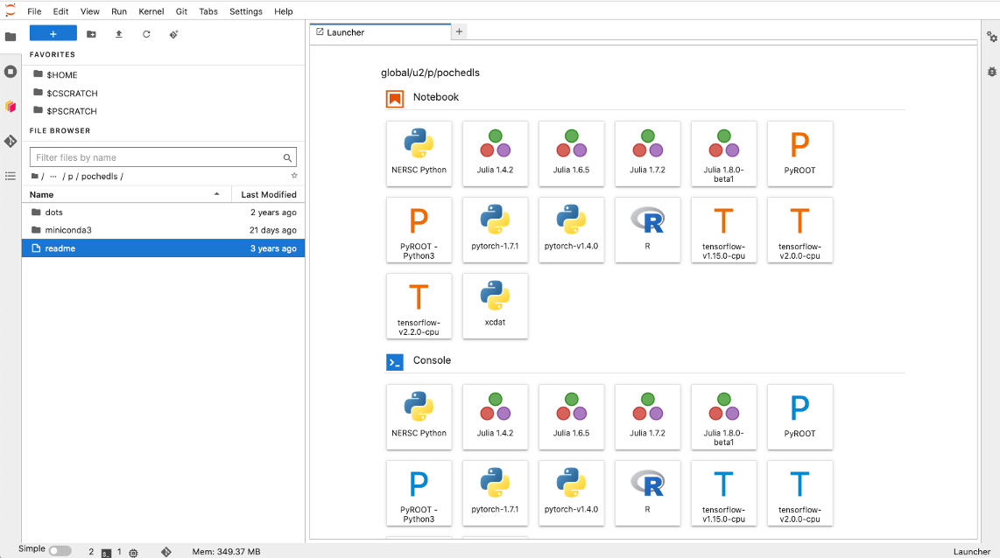

xCDAT on Jupyter and HPC Machines
=================================

xCDAT should be compatible with most high performance computing (HPC) platforms.
In general, xCDAT is available on Anaconda via the ``conda-forge`` channel.
xCDAT follows the same convention as other conda-based packages by being installable via
`conda <https://www.anaconda.com/products/distribution>`_. The conda installation
instructions in this guide are based on the instructions provided by
`NERSC <https://docs.nersc.gov/development/languages/python/nersc-python/>`_.

**Setup can vary depending on the exact HPC environment you are working in so please
consult your HPC documentation and/or HPC support resources. Some HPC environments
might have security settings that restrict user-managed conda installations and
environments.**

Setting up your xCDAT environment
---------------------------------

Ensure ``conda`` is installed
~~~~~~~~~~~~~~~~~~~~~~~~~~~~~

Generally, the installation instructions from `getting started guide <../installation.rst>`_ can also
be followed for HPC machines. This guide covers installing Miniconda3 and creating
a conda environment with the ``xcdat`` package.

Before installing Miniconda3, you should consult your HPC documentation to see if
``conda`` is already available; in some cases, ``python`` and ``conda`` may be
pre-installed on an HPC machine. You can check to see whether they are available by
entering ``which conda`` and/or ``which python`` in the command line (which will
return their path if they are available).

In other cases, ``python`` and ``conda`` are available via modules on an HPC machine. For
example, some machines make both available via:

::

   module load python

Once ``conda`` is active, you can create and activate a new ``xcdat`` environment
with ``xesmf`` (a recommended dependency):

::

   conda create -n <ENV_NAME> -c conda-forge xcdat xesmf
   conda activate <ENV_NAME>

Note that ``xesmf`` is an optional dependency, which is required for using ``xesmf``
based horizontal regridding APIs in ``xcdat``. ``xesmf`` is not currently supported
on `osx-arm64`_ or `windows`_ because ``esmpy`` is not yet available on these
platforms. Windows users can try `WSL2`_ as a workaround.

.. _windows: https://github.com/conda-forge/esmf-feedstock/issues/64
.. _osx-arm64: https://github.com/conda-forge/esmf-feedstock/issues/74
.. _WSL2: https://docs.microsoft.com/en-us/windows/wsl/install

You may also want to use ``xcdat`` with some additional packages. For example, you can
install ``xcdat`` with ``matplotlib``, ``ipython``, and ``ipykernel`` (see the next
section for more about ``ipykernel``):

::

   conda create -n <ENV_NAME> -c conda-forge xcdat xesmf matplotlib ipython ipykernel
   conda activate <ENV_NAME>

The advantage with following this approach is that conda will attempt to resolve
dependencies (e.g., python >= 3.8) for compatibility.

If you prefer, you can also add packages later with ``conda install`` (granted that
conda is able to resolve the compatible dependencies).

Adding an ``xcdat`` kernel for use with Jupyter
-----------------------------------------------

HPC systems frequently include a web interface to `Jupyter <https://docs.jupyter.org/en/latest/>`__,
which is a popular web application that is used to perform analyses in Python. In order
to use ``xcdat`` with Jupyter, you will need to create a kernel in your ``xcdat`` conda
environment using ``ipykernel``. These instructions follow those from
`NERSC <https://docs.nersc.gov/services/jupyter/#conda-environments-as-kernels>`__, but
setup can vary depending on the exact HPC environment you are working in so please
consult your HPC documentation. If you have not already installed ``ipykernel``, you can
install it in your ``xcdat`` environment (created above) with:

::

   conda activate <ENV NAME>
   conda install -c conda-forge ipykernel

Once ``ipykernel`` is added to your ``xcdat`` environment, you can create an ``xcdat``
kernel with:

::

   python -m ipykernel install --user --name <ENV NAME> --display-name <ENV NAME>

After the kernel is installed, login to the Jupyter instance on your HPC. Your ``xcdat``
kernel may be available on the home launch page (to open a new notebook or command line
instance). This launcher is sometimes accessed by clicking the blue plus symbol (see
screenshot below). Alternatively, you may need top open a new Notebook and then click
"Kernel" on the top bar -> click "Change Kernel..." and then select your ``xcdat``
kernel. You should then be able to use your ``xcdat`` environment on Jupyter.

|image0|

