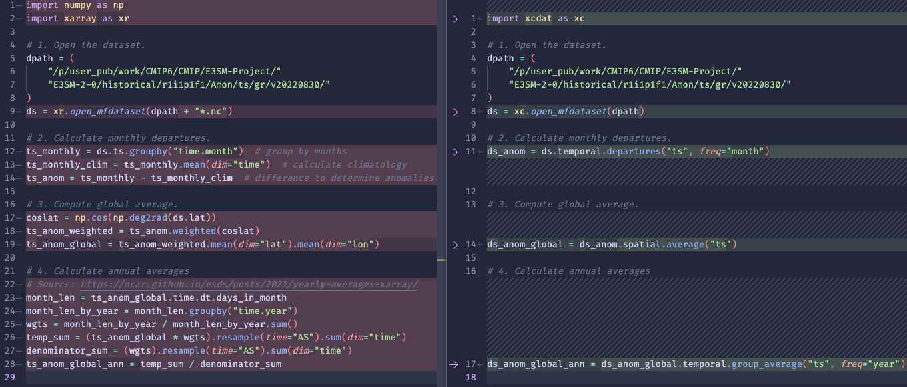

# Summary

xCDAT (Xarray Climate Data Analysis Tools) is an open-source Python package that extends Xarray (Hoyer & Hamman, 2017) for climate data analysis on structured grids. xCDAT streamlines analysis of climate and weather data by exposing common climate and weather analysis operations through a set of straightforward APIs. Some of xCDAT's key features include spatial averaging, temporal averaging, and regridding. These features are inspired by the Community Data Analysis Tools (CDAT) library (Williams et al., 2009; Williams, 2014; Doutriaux et al., 2019) and leverage powerful packages in the [Xarray](https://docs.xarray.dev/en/stable/) ecosystem including [xESMF](https://github.com/pangeo-data/xESMF) (Zhuang et al., 2023), [xgcm](https://xgcm.readthedocs.io/en/latest/) (Abernathey et al., 2022), and [CF xarray](https://cf-xarray.readthedocs.io/en/latest/) (Cherian et al., 2023). To ensure general compatibility across various climate models, xCDAT operates on datasets compliant with the Climate and Forecast (CF) metadata conventions (Hassell et al, 2017).

# Statement of need

Analysis of climate and weather data frequently requires a number of core operations, including reading and writing of netCDF files, horizontal and vertical regridding, and spatial and temporal averaging. While many individual software packages address these needs in a variety of computational languages, CDAT stands out because it provides these essential operations via open-source, interoperable Python packages. Since CDAT's inception, the volume of climate and weather data has grown substantially as the number of data products and their spatiotemporal resolution increases. Larger data stores are important for advancing geoscientific understanding, but also require increasingly performant software and hardware. These factors have sparked a need for new analysis software that offers core geospatial analysis functionalities capable of efficiently handling large datasets while using modern technologies and standardized software engineering principles.

xCDAT addresses this need by combining the power of Xarray with meticulously developed geospatial analysis features inspired by CDAT. Xarray is the foundation of xCDAT because of its widespread adoption, technological maturity, and ability to handle large datasets with parallel computing via Dask. Xarray is also interoperable with the scientific Python ecosystem (e.g., NumPy, Pandas, Matplotlib), which greatly benefits users who need to use additional tools for different scenarios. Since Xarray is designed as a general-purpose library, xCDAT fills in domain specific gaps by providing features to serve the climate science community _(refer to the Key Features section)_.

xCDAT's intentional design emphasizes software sustainability and reproducible science. It aims to make analysis code reusable, readable, and less-error prone by abstracting common Xarray boilerplate logic into simple and configurable APIs. xCDAT extends Xarray by using ["accessor" classes](https://docs.xarray.dev/en/stable/internals/extending-xarray.html) that operate directly on Xarray Dataset objects. xCDAT is rigorously tested using real-world datasets and maintains 100% unit test coverage (at the time this paper was written). To demonstrate the value in xCDAT's API design, Figure 1 compares code written with Xarray against xCDAT to calculate annual averages for global climatological anomalies. Figure 2 shows the plots for the results produced by xCDAT.

**Figure 1:** A comparison of the code to calculate annual averages for global climatological anomalies in Xarray (left) versus xCDAT (right). xCDAT abstracts most of the Xarray boilerplate logic for calculating weights and grouping data by specific time frequencies. This abstraction leads to code that is much more readable, maintainable, and flexible. The results from both sets of code are within machine precision.

**Figure 2:** A) Monthly surface skin temperature anomalies for September 1850. B) Monthly (gray) and annual (black) global mean surface skin temperature anomaly values. Temperature data is from an E3SMv2 climate model simulation over the historical period (1850 – 2014).

Performance is another fundamental driver in how xCDAT is designed, especially with large datasets. xCDAT conveniently inherits Xarray's support for parallel computing with Dask (Team, D. D.). [Parallel computing with Dask](https://docs.xarray.dev/en/stable/user-guide/dask.html) enables users to take advantage of compute resources through multithreading or multiprocessing. To use Dask's default multithreading scheduler, users only need to open and chunk datasets in Xarray before calling xCDAT APIs. xCDAT's seamless support for parallel computing enables users to run large-scale computations with minimal effort. If users require more resources, they can also configure and use a local Dask cluster to meet resource-intensive computational needs. Figure 3 shows xCDAT's significant performance advantage over CDAT for spatial averaging on datasets of varying sizes.

**Figure 3:** A performance benchmark for spatial averaging computations using xCDAT (serial and parallel using local Dask distributed scheduler) and CDAT (serial only). xCDAT serial and parallel outperforms CDAT by a wide margin for the 7 GB and 12 GB datasets. Note, runtimes could not be captured with xCDAT serial for the 105 GB file and CDAT with file sizes \>= 22 GB due to memory allocation errors. _Note: performance will vary depending on hardware, datasets, and how Dask and chunking schemes are configured. The performance benchmark setup and scripts are available in the_ [_xCDAT validation repo_](https://github.com/xCDAT/xcdat-validation/tree/main/validation/v0.6.0/xcdat-cdat-perf-metrics)_._

xCDAT's mission is to provide a maintainable and extensible package that serves the needs of the climate community in the long-term. xCDAT is a community-driven project and the development team encourages all who are interested to get involved through the [GitHub repository](https://github.com/xCDAT/xcdat).

# Key Features

## Extension of Xarray's `open_dataset()` and `open_mfdataset()` with post-processing options

xCDAT extends Xarray's `open_dataset()` and `open_mfdataset()` APIs with additional post-processing operations to support climate and weather data analysis. These APIs can generate missing coordinate bounds for the X, Y, T, and/or Z axes and lazily decode time coordinates represented by `cftime` ([more info](https://github.com/xCDAT/xcdat/pull/489#issuecomment-1579275827)). Other abilities include centering time coordinates between time bounds and converting the longitudinal axis orientation between [0, 360) and [-180, 180).

## Robust interpretation of CF metadata

xCDAT uses [CF xarray](https://cf-xarray.readthedocs.io/en/latest/) to interpret CF metadata present in datasets, enabling xCDAT to operate generally across climate models. This feature enables xCDAT to generate missing coordinate bounds, recognize the coordinates and coordinate bounds to use for computational operations, and lazily decode time coordinates based on the CF calendar attribute.

## Temporal averaging

xCDAT's temporal averaging API utilizes Xarray and Pandas. It includes features for calculating time series averages (single-snapshot), grouped time series averages (e.g., seasonal or annual averages), climatologies, and departures. Averages can be weighted (default) or unweighted. There are optional configurations for seasonal grouping including how to group the month of December (DJF or JFD) and defining custom seasons to group by.

## Geospatial weighted averaging

xCDAT's geospatial weighted averaging supports rectilinear grids with an option to specify regional domain for subsetting (e.g., tropical region, Niño 3.4 region).

## Horizontal structured regridding

xCDAT makes use of [xESMF](https://pangeo-xesmf.readthedocs.io/en/latest/) for horizontal regridding capabilities. It extends the xESMF horizontal regridding API by generating missing bounds and ensuring bounds and metadata are preserved in the output dataset. xCDAT also offers a Python implementation of[regrid2](https://cdms.readthedocs.io/en/latest/regrid2.html) for handling cartesian latitude by longitude grids.

## Vertical structured regridding

xCDAT makes use of [xgcm](https://xgcm.readthedocs.io/en/latest/) for vertical regridding capabilities. It extends thexgcm vertical regridding API by transposing the output data to match the dimensional order of the input data, and ensuring bounds and metadata are preserved in the output dataset.

# Documentation & Case Studies

The xCDAT [documentation](https://xcdat.readthedocs.io/en/stable/index.html) includes a Jupyter Notebook [Gallery](https://xcdat.readthedocs.io/en/stable/gallery.html) that demonstrates real-world applications of xCDAT:

-   [A Gentle Introduction to xCDAT (Xarray Climate Data Analysis Tools)](https://xcdat.readthedocs.io/en/stable/examples/introduction-to-xcdat.html)
-   [General Dataset Utilities](https://xcdat.readthedocs.io/en/stable/examples/general-utilities.html)
-   [Calculate Geospatial Weighted Averages from Monthly Time Series](https://xcdat.readthedocs.io/en/stable/examples/spatial-average.html)
-   [Calculate Time Averages from Time Series Data](https://xcdat.readthedocs.io/en/stable/examples/temporal-average.html)
-   [Calculating Climatology and Departures from Time Series Data](https://xcdat.readthedocs.io/en/stable/examples/climatology-and-departures.html)
-   [Horizontal Regridding](https://xcdat.readthedocs.io/en/stable/examples/regridding-horizontal.html)
-   [Vertical Regridding](https://xcdat.readthedocs.io/en/stable/examples/regridding-vertical.html)

# Distribution

xCDAT is available for Linux, MacOS, and Windows via the conda-forge channel on [Anaconda](https://anaconda.org/conda-forge/xcdat). The [GitHub Repository](https://github.com/xCDAT/xcdat) is where we host all development activity. xCDAT is released under the Apache 2-0 license.

# Projects using xCDAT

xCDAT is actively being integrated as a core component of the Program for Climate Model Diagnosis and Intercomparison (PCMDI) Metrics Package (Lee et al. 2023) and the Energy Exascale Earth System Model (E3SM) Diagnostics Package (Zhang et al. 2022; Zhang et al. 2023). xCDAT is also included in the E3SM Unified Anaconda Environment (Asay-Davis, 2023) deployed on numerous U.S Department of Energy supercomputers to run E3SM software tools. Members of the development team are also active users of xCDAT and apply the software to advance their own climate research (Po-Chedley et al, 2022).

# Acknowledgements

xCDAT is jointly developed by scientists and developers from the Energy Exascale Earth System Model ([E3SM](https://e3sm.org/)) Project and Program for Climate Model Diagnosis and Intercomparison ([PCMDI](https://pcmdi.llnl.gov/)). The work is performed for the E3SM project, which is sponsored by Earth System Model Development ([ESMD](https://climatemodeling.science.energy.gov/program/earth-system-model-development)) program, and the Simplifying ESM Analysis Through Standards ([SEATS](https://www.seatstandards.org/)) project, which is sponsored by the Regional and Global Model Analysis ([RGMA](https://climatemodeling.science.energy.gov/program/regional-global-model-analysis)) program. ESMD and RGMA are programs for the Earth and Environmental Systems Sciences Division ([EESSD](https://science.osti.gov/ber/Research/eessd)) in the Office of Biological and Environmental Research ([BER](https://science.osti.gov/ber)) within the[Department of Energy](https://www.energy.gov/)'s[Office of Science](https://science.osti.gov/). This work is performed under the auspices of the U.S. Department of Energy by LLNL under Contract No. DE-AC52-07NA27344.

Thank you to all of the xCDAT contributors and users who have opened up issues, pull requests, and discussions posts. We also give a special thanks to Karl Taylor, Peter Gleckler, Paul Durack, and Chris Golaz who all have provided valuable knowledge and guidance throughout the course of this project.
